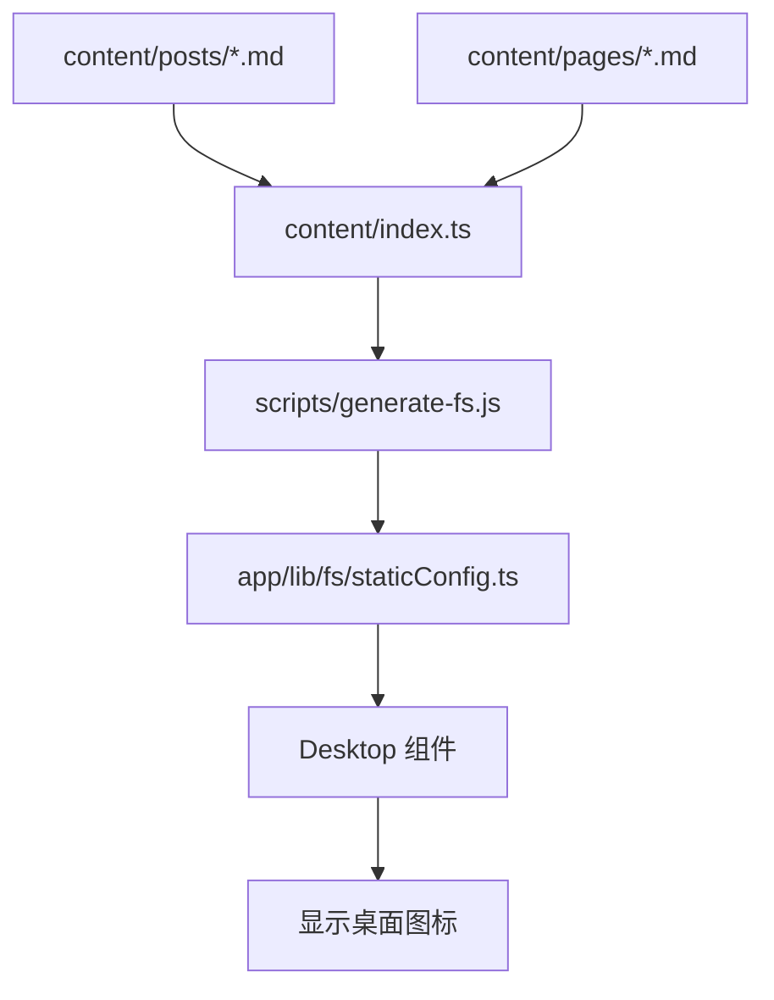
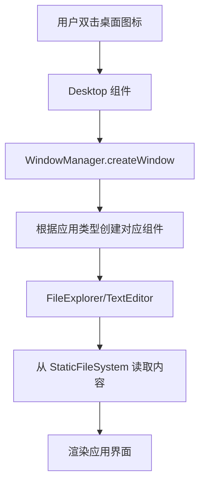
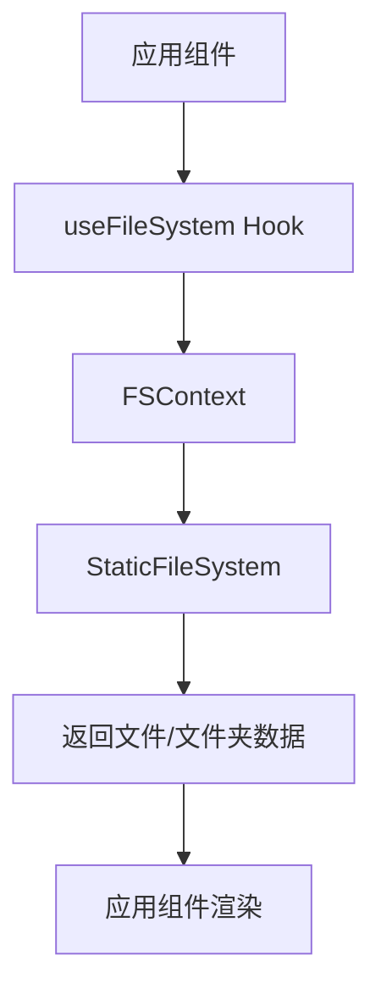

# Cabin 项目架构文档

## 1. 整体架构概述

### 1.1 架构模式
Cabin 采用 **Next.js App Router + React Client Components** 的混合架构模式：
- **服务端渲染 (SSR)**：页面结构和静态内容在服务端预渲染
- **客户端交互**：所有交互逻辑在客户端执行
- **静态导出**：支持完全静态站点生成，无需运行时服务器

### 1.2 技术栈
- **框架**：Next.js 14.2.35 (App Router)
- **UI 库**：@react95/core v9 + @react95/icons
- **状态管理**：React Context API
- **样式方案**：styled-components + CSS Modules
- **内容处理**：Markdown + react-markdown
- **构建工具**：Webpack (Next.js 内置)

### 1.3 部署架构
- **开发环境**：本地 Next.js 开发服务器
- **生产环境**：静态 HTML/CSS/JS 文件
- **部署目标**：GitHub Pages、Vercel、Netlify 等静态托管服务
- **无后端依赖**：完全客户端运行，零服务器成本

## 2. 目录结构

```
cabin/
├── app/                    # App Router 核心目录
│   ├── components/         # 可复用 UI 组件
│   │   ├── app/            # 应用特定组件
│   │   ├── icons/          # 图标组件
│   │   ├── vfs/            # 虚拟文件系统组件
│   │   └── window/         # 窗口系统组件
│   ├── config/             # 应用配置
│   │   ├── apps/           # 应用配置
│   │   └── main/           # 主配置
│   ├── desktop/            # 桌面环境组件
│   ├── lib/                # 核心库
│   │   ├── fs/             # 文件系统实现
│   │   └── vfs/            # 虚拟文件系统核心
│   ├── layout.tsx          # 根布局组件
│   └── page.tsx            # 首页入口组件
├── content/                # 内容源文件
│   ├── pages/              # 文档页面 (Markdown)
│   ├── posts/              # 博客文章 (Markdown)
│   └── index.ts            # 内容索引和元数据
├── scripts/                # 构建脚本
│   └── generate-fs.js      # 虚拟文件系统生成器
├── doc/                    # 项目文档
└── next.config.js          # Next.js 配置
```

## 3. 核心模块设计

### 3.1 桌面环境模块 (`app/desktop/`)
- **职责**：提供 Windows 95 风格的桌面用户体验
- **主要组件**：
  - `Desktop`：桌面容器，管理图标和窗口
  - `TaskBar`：任务栏组件，包含开始菜单和窗口指示器
- **状态管理**：通过类组件状态管理桌面图标和窗口引用

### 3.2 窗口系统模块 (`app/components/window/`)
- **职责**：管理应用程序窗口的生命周期和交互
- **主要组件**：
  - `WindowManager`：窗口管理器，协调所有窗口状态
  - `Window`：单个窗口组件，处理拖拽、最小化等操作
  - `ShortCutContainer`：桌面图标容器
  - `ContextMenu`：右键上下文菜单
- **状态管理**：使用 React Context (`FSContext`) 共享窗口状态

### 3.3 应用系统模块 (`app/components/app/`)
- **职责**：实现具体的应用程序功能
- **主要组件**：
  - `FileExplorer`：文件资源管理器，浏览虚拟文件系统
  - `TextEditor`：记事本应用，渲染 Markdown 内容
  - `MarkdownRenderer`：Markdown 渲染组件
- **数据流**：从虚拟文件系统读取内容，通过 props 传递给组件

### 3.4 文件系统模块 (`app/lib/fs/`)
- **职责**：提供虚拟文件系统的访问接口
- **核心文件**：
  - `staticConfig.ts`：静态文件系统配置（自动生成）
  - `FSContext.tsx`：文件系统 React Context
  - `FileSystem.ts`：文件系统操作工具函数
  - `RemovableDiskManager.ts`：可移动磁盘管理
- **数据结构**：树形结构，每个节点包含类型、名称、子项等信息

### 3.5 虚拟文件系统模块 (`app/lib/vfs/`)
- **职责**：提供动态虚拟文件系统的核心实现
- **核心类**：
  - `VirtualFileSystem`：VFS 核心类，支持 CRUD 操作
  - `FSLoader`：从元数据加载 VFS 结构
  - `ExportManager`：ZIP 导出功能
- **状态管理**：内部维护完整的文件系统状态树

### 3.6 内容管理模块 (`content/`)
- **职责**：管理所有静态内容源文件
- **目录结构**：
  - `posts/`：博客文章 (Markdown)
  - `pages/`：文档页面 (Markdown)
  - `index.ts`：内容索引，自动导入所有 Markdown 文件
- **构建集成**：通过 Webpack `?raw` 查询参数直接读取文件内容

## 4. 数据流设计

### 4.1 内容加载流程


### 4.2 应用启动流程


### 4.3 文件系统访问流程


## 5. 状态管理设计

### 5.1 全局状态
- **FSContext**：管理文件系统状态和可移动磁盘
- **WindowManager**：管理所有窗口实例和焦点状态
- **StaticFileSystem**：只读的静态文件系统配置

### 5.2 组件状态
- **Desktop**：管理桌面图标数组和窗口管理器引用
- **TaskBar**：管理开始菜单展开状态和活动窗口
- **Window**：管理窗口位置、尺寸、最小化状态

### 5.3 状态同步
- **单向数据流**：父组件向子组件传递状态
- **回调函数**：子组件通过回调通知父组件状态变化
- **Context 共享**：跨组件层级共享全局状态

## 6. 构建和部署流程

### 6.1 开发流程
```bash
# 1. 启动开发服务器
npm run dev

# 2. 自动执行构建脚本
node scripts/generate-fs.js

# 3. 生成 staticConfig.ts
# 4. 启动 Next.js 开发服务器
```

### 6.2 生产构建流程
```bash
# 1. 执行构建命令
npm run build

# 2. 自动执行构建脚本
node scripts/generate-fs.js

# 3. 生成 staticConfig.ts
# 4. Next.js 编译和优化
# 5. 生成 .next 目录
```

### 6.3 静态导出流程
```bash
# 1. 执行导出命令
npm run export

# 2. 执行构建流程
# 3. 生成静态 HTML 文件
# 4. 输出到 out/ 目录
```

## 7. 性能优化策略

### 7.1 构建时优化
- **内容预处理**：Markdown 在构建时转换为 HTML
- **代码分割**：按路由和组件自动分割代码包
- **静态生成**：所有页面预渲染为静态 HTML

### 7.2 运行时优化
- **懒加载**：窗口组件按需加载
- **Memoization**：使用 React.memo 优化重复渲染
- **虚拟滚动**：大列表使用虚拟滚动优化

### 7.3 资源优化
- **图标优化**：SVG 图标内联，减少 HTTP 请求
- **样式优化**：styled-components 自动生成最小 CSS
- **缓存策略**：静态资源设置长期缓存

## 8. 扩展性设计

### 8.1 应用扩展
- **配置驱动**：通过 `app/config/apps/` 添加新应用
- **组件注册**：在 `WindowManager` 中注册新应用组件
- **图标映射**：在图标系统中添加新应用图标

### 8.2 内容扩展
- **自动发现**：在 `content/` 目录添加新 Markdown 文件
- **元数据更新**：更新 `content/index.ts` 中的元数据
- **构建集成**：自动包含在虚拟文件系统中

### 8.3 功能扩展
- **插件系统**：预留插件接口（未来扩展）
- **主题系统**：支持不同视觉主题
- **国际化**：预留多语言支持

## 9. 当前架构问题分析

### 9.1 已识别问题
- **StaticFileSystem 加载问题**：运行时出现 undefined 错误
- **双重文件系统**：同时存在静态配置和动态 VFS，造成复杂性
- **调试日志残留**：控制台存在大量调试输出

### 9.2 根本原因
- **模块加载时序**：Next.js SSR 和客户端加载时序不一致
- **架构冗余**：静态配置和动态 VFS 功能重叠
- **开发残留**：调试代码未清理

### 9.3 解决方案
- **统一文件系统**：移除动态 VFS，完全依赖静态配置
- **安全加载检查**：添加 StaticFileSystem 存在性检查
- **清理调试代码**：移除所有 console.log 语句

## 10. 架构演进路线

### 10.1 短期目标（验收前）
- ✅ 统一文件系统架构
- ✅ 修复 StaticFileSystem 加载问题
- ✅ 清理调试代码和警告

### 10.2 中期目标（验收后）
- 🔜 完善可移动磁盘功能
- 🔜 添加图片查看器支持
- 🔜 优化移动端体验

### 10.3 长期目标
- 🔜 实现完整的插件系统
- 🔜 支持用户自定义主题
- 🔜 添加文件搜索和过滤功能
- 🔜 实现离线存储和同步