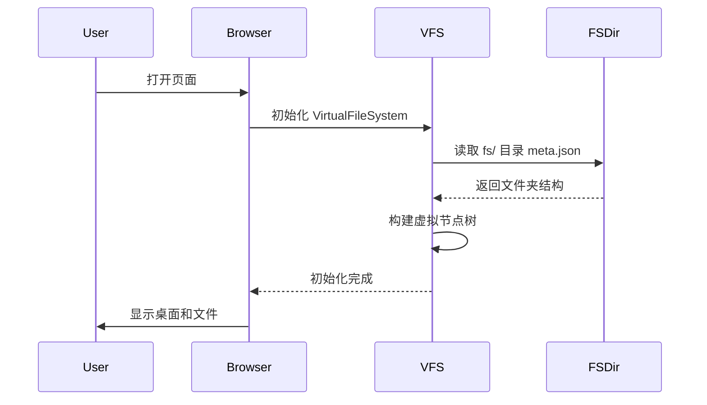
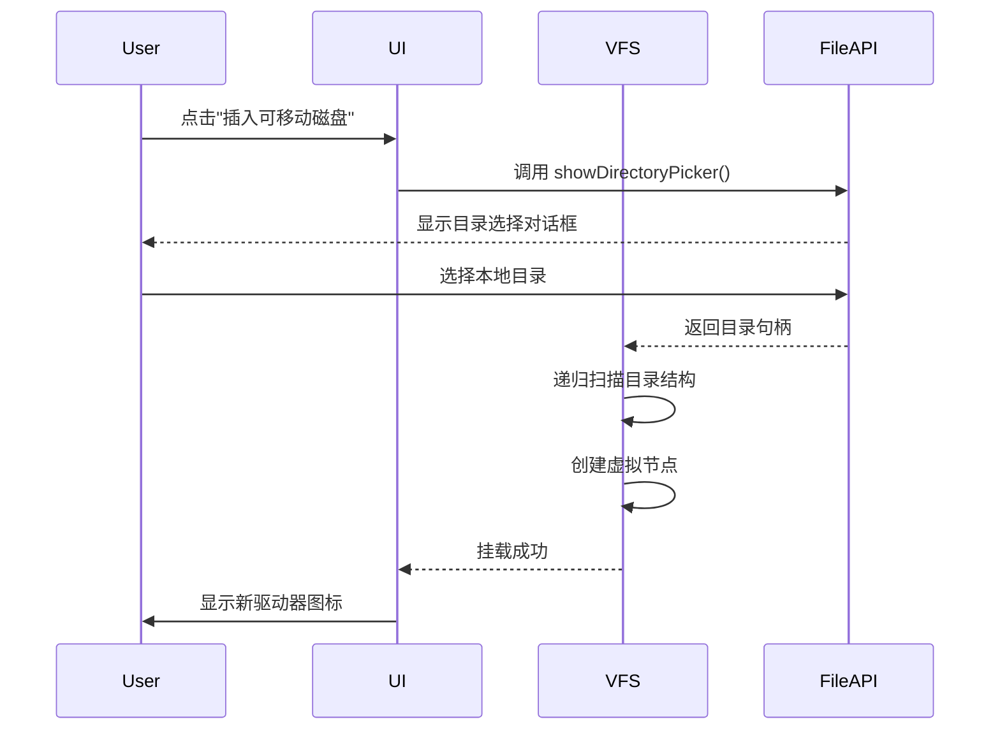
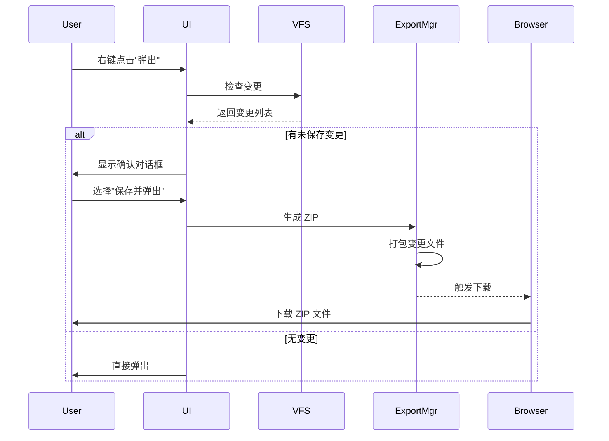

# 虚拟化存储空间设计方案

**Agent**: UX Architect  
**创建日期**: 2026-03-17  
**状态**: 🟡 设计中  

---

## 需求概述

设计一个 Win95 风格的虚拟文件系统，支持：
1. **初始加载**: 页面首次加载时初始化 `fs/` 目录的虚拟数据
2. **可移动磁盘**: 模拟"可移动磁盘"或"载入 CD"，通过浏览器选择本地目录加载
3. **浏览器操作**: 用户可在浏览器中查看、编辑虚拟文件
4. **延迟写入**: 修改不直接写入磁盘，在"弹出"时询问是否保存
5. **导出 ZIP**: 确认保存后显示修改列表并导出为 ZIP

---

## 系统架构

### 整体架构图

```
┌─────────────────────────────────────────────────────────┐
│                    用户浏览器                            │
│  ┌───────────────────────────────────────────────────┐  │
│  │          VirtualFileSystem (内存中)                │  │
│  │  ┌─────────────┐  ┌─────────────┐  ┌───────────┐ │  │
│  │  │ Initial FS  │  │ Removable   │  │ Recycle   │ │  │
│  │  │ (fs/ 目录)  │  │ (用户选择)  │  │ Bin       │ │  │
│  │  └─────────────┘  └─────────────┘  └───────────┘ │  │
│  └───────────────────────────────────────────────────┘  │
│                          ↓                               │
│  ┌───────────────────────────────────────────────────┐  │
│  │         FileSystem State Manager                  │  │
│  │  - 当前路径导航                                    │  │
│  │  - 文件/文件夹 CRUD                                │  │
│  │  - 变更追踪 (Change Tracking)                      │  │
│  └───────────────────────────────────────────────────┘  │
│                          ↓                               │
│  ┌───────────────────────────────────────────────────┐  │
│  │         Export Manager                            │  │
│  │  - 变更列表生成                                    │  │
│  │  - ZIP 打包 (JSZip)                               │  │
│  │  - 文件下载                                        │  │
│  └───────────────────────────────────────────────────┘  │
└─────────────────────────────────────────────────────────┘
```

---

## 数据结构设计

### 1. 虚拟文件节点

```typescript
// 基础文件节点类型
type VNodeType = 'file' | 'folder' | 'removable' | 'cdrom';

interface VFileNode {
  id: string;              // 唯一标识符
  name: string;            // 文件名
  type: 'file';            // 节点类型
  path: string;            // 完整路径
  content: string;         // 文件内容（文本）
  mimeType?: string;       // MIME 类型
  size: number;            // 文件大小（字节）
  createdAt: number;       // 创建时间戳
  modifiedAt: number;      // 修改时间戳
  isModified: boolean;     // 是否在内存中被修改
  metadata?: Record<string, any>; // 额外元数据
}

interface VFolderNode {
  id: string;              // 唯一标识符
  name: string;            // 文件夹名
  type: 'folder';          // 节点类型
  path: string;            // 完整路径
  children: string[];      // 子节点 ID 列表
  createdAt: number;       // 创建时间戳
  isRoot?: boolean;        // 是否是根目录
  isRemovable?: boolean;   // 是否是可移动磁盘
}

type VNode = VFileNode | VFolderNode;
```

### 2. 虚拟文件系统状态

```typescript
interface VirtualFileSystemState {
  // 所有节点（扁平化存储）
  nodes: Map<string, VNode>;
  
  // 根目录 ID
  rootId: string;
  
  // 当前路径
  currentPath: string;
  
  // 历史记录（前进/后退）
  history: string[];
  historyIndex: number;
  
  // 变更追踪
  changes: Map<string, ChangeRecord>;
  
  // 可移动磁盘
  removableDrives: Map<string, DriveInfo>;
}

interface DriveInfo {
  id: string;              // 驱动器 ID（如 "E:"）
  name: string;            // 驱动器名称
  type: 'removable' | 'cdrom';
  rootId: string;          // 根文件夹 ID
  isMounted: boolean;      // 是否已挂载
}

interface ChangeRecord {
  fileId: string;
  action: 'create' | 'update' | 'delete' | 'rename';
  originalContent?: string;  // 原始内容（用于对比）
  newContent?: string;       // 新内容
  timestamp: number;
}
```

### 3. 初始化数据结构

```typescript
// fs/ 目录的初始化数据示例
const initialFSData = {
  '/': {
    id: 'root',
    name: '桌面',
    type: 'folder',
    children: ['my-computer', 'my-documents', 'my-pictures', 'my-blog', 'recycle-bin'],
    isRoot: true,
  },
  '/my-computer': {
    id: 'my-computer',
    name: '我的电脑',
    type: 'folder',
    children: ['c-drive', 'd-drive'],
  },
  '/my-computer/c-drive': {
    id: 'c-drive',
    name: '本地磁盘 (C:)',
    type: 'folder',
    children: ['windows', 'program-files', 'users'],
  },
  // ... 更多文件夹
};
```

---

## 核心功能模块

### 模块 1: VirtualFileSystem Class

```typescript
class VirtualFileSystem {
  private state: VirtualFileSystemState;
  
  constructor(initialData: Record<string, any>) {
    this.state = this.initializeFromData(initialData);
  }
  
  // === 导航功能 ===
  
  // 进入文件夹
  navigateTo(path: string): boolean {
    const node = this.getNodeByPath(path);
    if (node?.type === 'folder') {
      this.state.currentPath = path;
      this.addToHistory(path);
      return true;
    }
    return false;
  }
  
  // 返回上级
  navigateUp(): boolean {
    const parentPath = this.getParentPath(this.state.currentPath);
    if (parentPath) {
      return this.navigateTo(parentPath);
    }
    return false;
  }
  
  // 前进/后退
  goBack(): boolean { /* ... */ }
  goForward(): boolean { /* ... */ }
  
  // === 文件操作 ===
  
  // 读取文件
  readFile(path: string): string | null {
    const node = this.getNodeByPath(path);
    if (node?.type === 'file') {
      return node.content;
    }
    return null;
  }
  
  // 写入文件（标记为修改）
  writeFile(path: string, content: string): boolean {
    const node = this.getNodeByPath(path);
    if (node?.type === 'file') {
      // 记录变更
      this.state.changes.set(node.id, {
        fileId: node.id,
        action: 'update',
        originalContent: node.content,
        newContent: content,
        timestamp: Date.now(),
      });
      
      // 更新内存中的内容
      node.content = content;
      node.modifiedAt = Date.now();
      node.isModified = true;
      
      return true;
    }
    return false;
  }
  
  // 创建文件
  createFile(path: string, content: string = ''): string | null {
    // 生成新 ID
    const fileId = this.generateId();
    const fileNode: VFileNode = {
      id: fileId,
      name: this.getFileName(path),
      type: 'file',
      path,
      content,
      size: content.length,
      createdAt: Date.now(),
      modifiedAt: Date.now(),
      isModified: true,
    };
    
    // 添加到父文件夹
    const parentPath = this.getParentPath(path);
    const parentNode = this.getNodeByPath(parentPath);
    if (parentNode?.type === 'folder') {
      parentNode.children.push(fileId);
      this.state.nodes.set(fileId, fileNode);
      
      // 记录变更
      this.state.changes.set(fileId, {
        fileId,
        action: 'create',
        newContent: content,
        timestamp: Date.now(),
      });
      
      return fileId;
    }
    return null;
  }
  
  // 删除文件（移动到回收站）
  deleteFile(path: string): boolean {
    // 实现回收站逻辑
  }
  
  // === 可移动磁盘功能 ===
  
  // 挂载用户选择的目录
  async mountRemovableDrive(
    type: 'removable' | 'cdrom',
    directoryHandle: FileSystemDirectoryHandle
  ): Promise<string> {
    const driveId = this.generateDriveId(type);
    const rootId = await this.scanDirectory(directoryHandle, driveId);
    
    this.state.removableDrives.set(driveId, {
      id: driveId,
      name: type === 'removable' ? '可移动磁盘 (E:)' : 'CD 驱动器 (F:)',
      type,
      rootId,
      isMounted: true,
    });
    
    return driveId;
  }
  
  // 扫描目录并创建虚拟节点
  private async scanDirectory(
    handle: FileSystemDirectoryHandle,
    parentId: string
  ): Promise<string> {
    // 使用 File System Access API 递归扫描
  }
  
  // 弹出磁盘
  ejectDrive(driveId: string): Promise<EjectResult> {
    const changes = this.getChangesForDrive(driveId);
    
    if (changes.length > 0) {
      // 有未保存的更改，需要询问用户
      return {
        hasChanges: true,
        changes,
        requiresConfirmation: true,
      };
    }
    
    return { hasChanges: false };
  }
  
  // === 变更管理 ===
  
  // 获取所有变更
  getAllChanges(): ChangeRecord[] {
    return Array.from(this.state.changes.values());
  }
  
  // 清除变更记录
  clearChanges(): void {
    this.state.changes.clear();
  }
  
  // 撤销最后一次修改
  undoLastChange(fileId: string): boolean {
    const change = this.state.changes.get(fileId);
    if (change && change.action === 'update') {
      const node = this.state.nodes.get(fileId);
      if (node?.type === 'file') {
        node.content = change.originalContent!;
        node.isModified = false;
        this.state.changes.delete(fileId);
        return true;
      }
    }
    return false;
  }
}
```

### 模块 2: ExportManager (ZIP 导出)

```typescript
import JSZip from 'jszip';

class ExportManager {
  private vfs: VirtualFileSystem;
  
  constructor(vfs: VirtualFileSystem) {
    this.vfs = vfs;
  }
  
  // 生成变更报告
  generateChangeReport(): ChangeReport {
    const changes = this.vfs.getAllChanges();
    
    const report: ChangeReport = {
      totalFiles: changes.length,
      createdFiles: changes.filter(c => c.action === 'create'),
      updatedFiles: changes.filter(c => c.action === 'update'),
      deletedFiles: changes.filter(c => c.action === 'delete'),
      timestamp: Date.now(),
    };
    
    return report;
  }
  
  // 导出为 ZIP
  async exportToZip(options: ExportOptions = {}): Promise<Blob> {
    const zip = new JSZip();
    const changes = this.vfs.getAllChanges();
    
    // 只导出有变更的文件
    for (const change of changes) {
      if (change.action === 'delete') {
        continue; // 跳过上除的文件
      }
      
      const node = this.vfs.getNodeById(change.fileId);
      if (node?.type === 'file') {
        // 计算相对路径
        const relativePath = this.getRelativePath(node.path);
        
        if (change.action === 'create' || change.action === 'update') {
          zip.file(relativePath, node.content);
        }
      }
    }
    
    // 生成 ZIP
    const blob = await zip.generateAsync({
      type: 'blob',
      compression: 'DEFLATE',
      compressionOptions: { level: 6 },
    });
    
    return blob;
  }
  
  // 下载 ZIP 文件
  downloadZip(blob: Blob, filename: string = 'cabin-export.zip'): void {
    const url = URL.createObjectURL(blob);
    const a = document.createElement('a');
    a.href = url;
    a.download = filename;
    document.body.appendChild(a);
    a.click();
    document.body.removeChild(a);
    URL.revokeObjectURL(url);
  }
}
```

### 模块 3: React Hooks

```typescript
// useVirtualFileSystem Hook
function useVirtualFileSystem() {
  const [vfs] = useState(() => new VirtualFileSystem(initialFSData));
  const [currentPath, setCurrentPath] = useState('/');
  const [nodes, setNodes] = useState<VNode[]>([]);
  const [loading, setLoading] = useState(false);
  
  // 监听当前路径变化，加载文件夹内容
  useEffect(() => {
    const folder = vfs.getNodeByPath(currentPath);
    if (folder?.type === 'folder') {
      const children = folder.children.map(id => vfs.getNodeById(id));
      setNodes(children.filter(Boolean) as VNode[]);
    }
  }, [currentPath, vfs]);
  
  return {
    vfs,
    currentPath,
    nodes,
    loading,
    navigateTo: (path: string) => {
      setLoading(true);
      const success = vfs.navigateTo(path);
      setCurrentPath(vfs.state.currentPath);
      setLoading(false);
      return success;
    },
    navigateUp: () => {
      const success = vfs.navigateUp();
      setCurrentPath(vfs.state.currentPath);
      return success;
    },
  };
}

// useRemovableDrive Hook
function useRemovableDrive() {
  const [drives, setDrives] = useState<DriveInfo[]>([]);
  const [isMounting, setIsMounting] = useState(false);
  
  const mountDrive = async (type: 'removable' | 'cdrom') => {
    try {
      setIsMounting(true);
      // 请求用户选择目录
      const dirHandle = await window.showDirectoryPicker();
      // 挂载到虚拟文件系统
      const driveId = await vfs.mountRemovableDrive(type, dirHandle);
      setDrives(prev => [...prev, driveInfo]);
      return driveId;
    } catch (error) {
      console.error('挂载失败:', error);
      throw error;
    } finally {
      setIsMounting(false);
    }
  };
  
  const ejectDrive = async (driveId: string) => {
    const result = await vfs.ejectDrive(driveId);
    if (result.hasChanges) {
      // 显示确认对话框
      return showEjectConfirmation(result.changes);
    }
    // 卸载驱动器
    setDrives(prev => prev.filter(d => d.id !== driveId));
  };
  
  return { drives, isMounting, mountDrive, ejectDrive };
}
```

---

## 用户交互流程

### 流程 1: 页面首次加载



### 流程 2: 挂载可移动磁盘



### 流程 3: 弹出磁盘并保存



---

## UI 组件设计

### 1. 文件浏览器增强

```tsx
interface FileExplorerProps {
  currentPath: string;
  onNavigate: (path: string) => void;
  onFileOpen: (path: string) => void;
}

const FileExplorer: React.FC<FileExplorerProps> = ({
  currentPath,
  onNavigate,
  onFileOpen,
}) => {
  const { nodes } = useVirtualFileSystem();
  const { drives, mountDrive, ejectDrive } = useRemovableDrive();
  
  return (
    <div className="file-explorer">
      {/* 工具栏 */}
      <Toolbar>
        <Button onClick={() => mountDrive('removable')}>
          💾 插入可移动磁盘
        </Button>
        <Button onClick={() => mountDrive('cdrom')}>
          💿 载入 CD
        </Button>
      </Toolbar>
      
      {/* 地址栏 */}
      <AddressBar path={currentPath} onNavigate={onNavigate} />
      
      {/* 驱动器列表 */}
      {drives.length > 0 && (
        <DriveList>
          {drives.map(drive => (
            <DriveIcon
              key={drive.id}
              drive={drive}
              onEject={() => ejectDrive(drive.id)}
            />
          ))}
        </DriveList>
      )}
      
      {/* 文件网格 */}
      <FileGrid>
        {nodes.map(node => (
          <FileIcon
            key={node.id}
            node={node}
            onDoubleClick={() => handleOpen(node)}
          />
        ))}
      </FileGrid>
    </div>
  );
};
```

### 2. 弹出确认对话框

```tsx
interface EjectConfirmationDialogProps {
  changes: ChangeRecord[];
  onConfirm: () => void;
  onCancel: () => void;
}

const EjectConfirmationDialog: React.FC<EjectConfirmationDialogProps> = ({
  changes,
  onConfirm,
  onCancel,
}) => {
  return (
    <Window title="确认弹出" width={500} height={400}>
      <div className="eject-dialog">
        <p>
          ⚠️ 有以下 {changes.length} 个文件被修改，是否保存到磁盘？
        </p>
        
        <FileChangeList changes={changes} />
        
        <div className="dialog-actions">
          <Button onClick={onConfirm} primary>
            💾 保存并弹出
          </Button>
          <Button onClick={onCancel}>
            ❌ 不保存
          </Button>
          <Button onClick={onCancel}>
            ↩️ 取消弹出
          </Button>
        </div>
      </div>
    </Window>
  );
};
```

### 3. 变更列表展示

```tsx
const FileChangeList: React.FC<{ changes: ChangeRecord[] }> = ({ changes }) => {
  return (
    <ul className="change-list">
      {changes.map(change => {
        const node = useNode(change.fileId);
        return (
          <li key={change.fileId} className={`change-item ${change.action}`}>
            <ChangeIcon action={change.action} />
            <span className="file-name">{node?.name}</span>
            <span className="action-label">
              {getActionLabel(change.action)}
            </span>
          </li>
        );
      })}
    </ul>
  );
};
```

---

## 技术依赖

### NPM 包安装

```bash
# ZIP 生成
npm install jszip
npm install --save-dev @types/jszip

# 可选：增强的文件操作
npm install browser-fs-access
```

### TypeScript 配置

```json
{
  "compilerOptions": {
    "lib": ["ES2020", "DOM"],
    "target": "ES2020"
  }
}
```

---

## 实现优先级

### Phase 1: 核心功能（高优先级）
- [ ] VirtualFileSystem 类实现
- [ ] 从 fs/ 目录初始化数据
- [ ] 基本文件浏览和编辑
- [ ] 变更追踪系统

### Phase 2: 可移动磁盘（中优先级）
- [ ] File System Access API 集成
- [ ] 挂载本地目录
- [ ] 弹出确认对话框
- [ ] ZIP 导出功能

### Phase 3: 用户体验优化（低优先级）
- [ ] 拖拽上传文件
- [ ] 批量操作
- [ ] 撤销/重做
- [ ] 搜索功能

---

## 边界情况处理

### 1. 大文件处理
- 限制单个文件最大 10MB
- 超过限制时显示警告
- 使用流式处理避免内存溢出

### 2. 权限问题
- 只读目录明确标识
- 无法写入时显示友好提示
- 提供"另存为"选项

### 3. 浏览器兼容性
- File System Access API 仅 Chrome/Edge 支持
- Firefox/Safari 降级为文件输入
- 提供 polyfill 或替代方案

---

## 验收标准

- ✅ 页面加载时正确初始化 fs/ 目录数据
- ✅ 可以通过浏览器选择器加载本地目录
- ✅ 在浏览器中编辑文件不会立即写入磁盘
- ✅ 弹出时显示准确的变更列表
- ✅ 导出的 ZIP 包含所有修改的文件
- ✅ ZIP 文件结构保持原有目录层级
- ✅ 支持多个可移动磁盘同时挂载

---

## 下一步

1. 与 Frontend Developer 对接技术实现细节
2. 评审数据结构和 API 设计
3. 确定 Phase 1 的开发排期
4. 准备测试数据和用例
